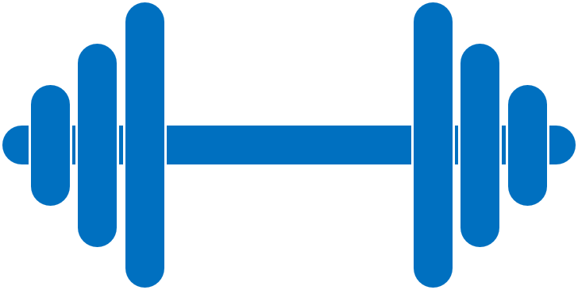
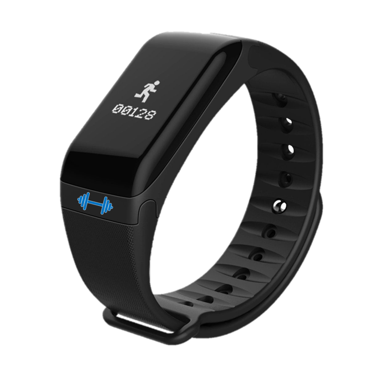

## Welcome to FairFit

We are FairFit, a (fictional) University of Zurich (UZH) spinoff that is offering a new wearable device called _FairFit Tracker_. FairFit's team, organizational, and technical setup are the subject of the UZH course [link-to-course](courselink).

## The Fair-Fit Tracker

FairFit Tracker devices are activity trackers in a bracelet form factor that measure data related to an individual’s fitness and health. The bracelets integrate sensors which measure: step count, location, pulse, heart rate, body temperature, sleep duration, and proximity of other Fair-Fit-Tracker devices. For a more accurate service, users provide additional data about their physiology (namely: height, age, and weight), enter their fitness and health goals (namely: daily activity, weight, sleep duration) and log their current physical status (namely: stressed, tired, body aches) using a smartphone application that is furnished by FFTrack as well. The combination of this data (sensor, physiological, physical) enables the company to derive information about users’ daily fitness activities and health status. 
